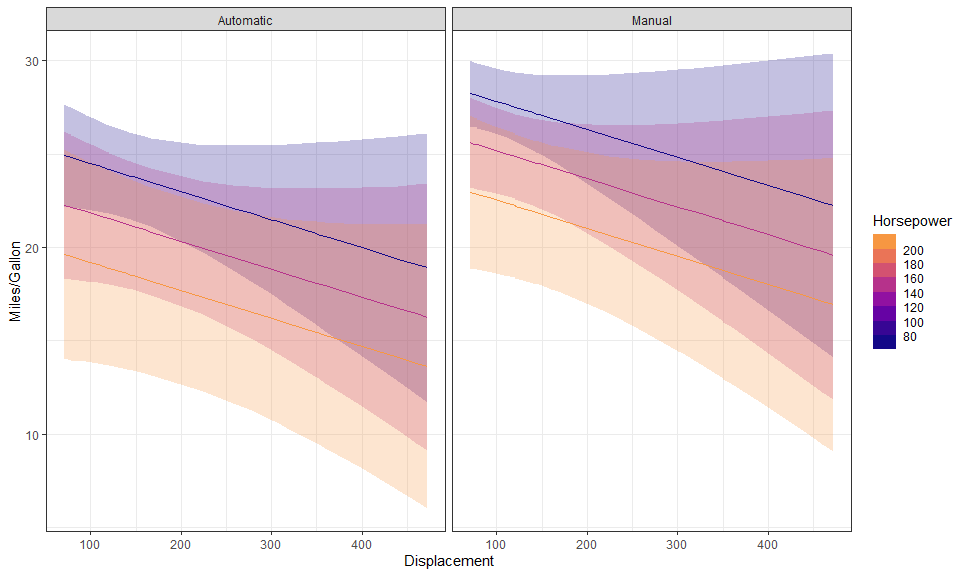
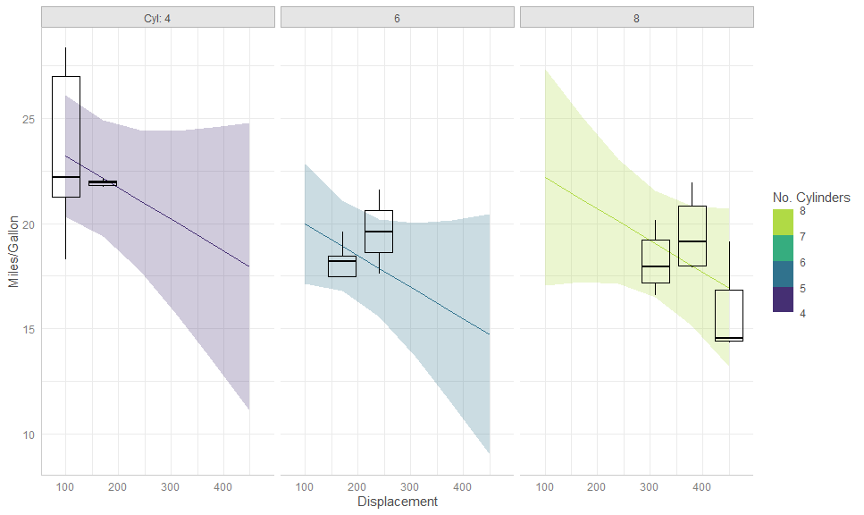
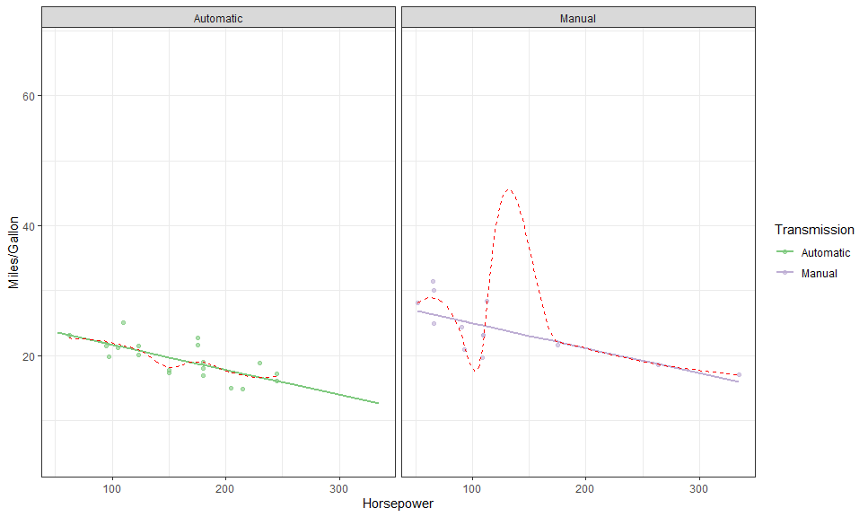

# `ggggeffects`

The goal of `ggggeffects` is to allow for a `ggplot2` syntax for the
actual plotting of the data-grid provided by
[`ggeffects`](https://strengejacke.github.io/ggeffects).

I built this because I love
[`ggeffects`](https://strengejacke.github.io/ggeffects), but I wanted
more control over the plotting.

``` r
library(ggggeffects)
```

    ## Loading required package: ggeffects

    ## Loading required package: ggplot2

## Installation

``` r
# install.packages("remotes")
remotes::install_github("mattansb/ggggeffects")
```

## Examples

Fit a model from the `mtcars` data:

``` r
fit <- lm(mpg ~ factor(carb) + am + disp + hp, mtcars)
```

### Full `ggplot2` Customizability

``` r
gge <- ggpredict(fit, terms = c("carb", "am"))

# Compare
plot(gge)
```

<!-- -->

``` r
# To:
autoplot(gge) +
  geom_CI_bar() +
  geom_expected_point()
```

<!-- -->

The default plot is better looking than the ugly `ggplot2` default,
however `ggggeffects` is fully customisable, as would be expected (also
note that the `am` is retained as a numeric variable):

``` r
am_labeller <- as_labeller(c("0" = "Automatic", "1" = "Manual"))

autoplot(
  gge, 
  aes(color = factor(am), fill = after_scale(color)),
  cols = vars(am), 
  labeller = labeller(am = am_labeller)
) +
  # Expected + CI
  geom_CI_bar(type = "linerange", color = "black", position = position_dodge(0.3)) +
  geom_expected_point(size = 3, position = position_dodge(0.3)) +
  # Scales and theme
  scale_color_brewer(NULL, labels = c("Automatic", "Manual"), type = "qual") +
  theme_bw() +
  labs(x = "No. Cylinders", y = "Miles/Gallon")
```

<!-- -->

Here is another example, with a continuous variable on x:

``` r
gge <- ggpredict(fit, c("disp [all]", "hp [meansd]", "am"))

autoplot(
  gge,
  aes(color = NULL, fill = NULL),
  rows = vars(hp),
  labeller = labeller(am = as_labeller(c("0" = "Automatic", "1" = "Manual")),
                      hp = label_both)
) +
  # Expected + CI
  geom_CI_ribbon(fill = NA, color = "black", linetype = "dashed") +
  geom_expected_line() +
  theme_bw() +
  labs(y = "Miles/Gallon", x = "Displacement")
```

<!-- -->

``` r
hp_breaks <- setNames(as.numeric(levels(gge$group)), c("-sd", "mean", "+sd"))

(p <- autoplot(gge, labeller = labeller(am = as_labeller(c("0" = "Automatic", "1" = "Manual")))) +
    # Expected + CI
    geom_CI_ribbon() +
    geom_expected_line() +
    # Scales and theme
    scale_color_viridis_c("Horsepower", breaks = hp_breaks,
                          limits = c(50, 330),
                          aesthetics = c("color", "fill")) +
    theme_bw() +
    labs(y = "Miles/Gallon", x = "Displacement"))
```

<!-- -->

### Adding Raw/Residualized Data

We can use `layer_fit_data()` to add the raw data to the plot! It’s so
simple!

``` r
p + layer_fit_data(shape = 21, color = "black")
```

<!-- -->

We can also create partial residual plots with
`layer_fit_data(residuals = TRUE)`:

``` r
p + layer_fit_data(residuals = TRUE, shape = 21, color = "black")
```

<!-- -->

We can even plot them side by side:

``` r
p +
  # Data
  layer_fit_data(aes(shape = "Raw"), 
                 size = 2) +
  layer_fit_data(aes(shape = "Residualized"), residuals = TRUE,
                 size = 3,
                 position = position_nudge(x = 10)) +
  # Scales and theme
  scale_shape_manual(NULL, values = c(4, 16))
```

<!-- -->

These can also be used with other stats:

``` r
gge <- ggpredict(fit, terms = c("disp [100:500, by = 70]", "carb"))

autoplot(gge, 
         aes(color = as.numeric(levels(carb))[carb],
             fill = as.numeric(levels(carb))[carb])) + 
  facet_wrap(vars(carb)) + 
  # Expected + CI
  geom_CI_ribbon() + 
  geom_expected_line() +
  # Boxplot of partial residuals
  layer_fit_data(aes(group = interaction(disp, carb)), 
                 residuals = TRUE,
                 fill = NA, color = "black",
                 geom = "boxplot", stat = "boxplot") + # <<<<
  # Scales and theme
  scale_color_binned("No. Carburetors", aesthetics = c("color", "fill"),
                     breaks = unique(mtcars$carb),
                     limits = c(0.5, 8.5),
                     type = "viridis", option = "B", begin = 0.1,
                     guide = guide_colorsteps(even.steps = FALSE)) +
  labs(y = "Miles/Gallon", x = "Displacement") + 
  theme_ggeffects()
```

<!-- -->

``` r
gge <- ggpredict(fit, terms = c("hp [all]", "am"))

autoplot(gge, aes(color = factor(am), fill = after_scale(color)), 
         cols = vars(am),
         labeller = labeller(am = as_labeller(c("0" = "Automatic", "1" = "Manual")))) + 
  # Expected
  geom_expected_line(size = 1) +
  # Partial residuals
  layer_fit_data(residuals = TRUE, alpha = 0.6) + 
  # Smoothed line
  layer_fit_data(residuals = TRUE, 
                 geom = "line", stat = "smooth",  # <<<<
                 linetype = "dashed", color = "red") +
  # Scales and theme
  scale_color_brewer("Transmission", type = "qual", 
                     labels = c("Automatic", "Manual"),
                     aesthetics = c("color", "fill")) +
  theme_bw() +
  labs(y = "Miles/Gallon", x = "Horsepower")
```

    ## `geom_smooth()` using method = 'loess' and formula 'y ~ x'

<!-- -->

### Raster Plots

We can also plot bi-variate raster plots:

``` r
mod <- lm(Volume ~ poly(Girth, 3) * Height, data = trees)

gge <- ggpredict(mod, c("Girth [n=25]", "Height [n=25]"))

autoplot(gge, aes(x = Girth, y = Height,
                  color = NULL, group = NULL, # need to override
                  fill = predicted)) +
  # Expected values
  geom_raster() +
  geom_contour(aes(z = predicted),
               color = "white") +
  # Data
  layer_fit_data(shape = 21, color = "white", size = 2) +
  # Scales and theme
  scale_fill_viridis_c("Volume", option = "A") +
  theme_bw()
```

<!-- -->

This is especially useful for plotting multi-variate smooth terms in
GAMs:

``` r
library(mgcv)

eg <- gamSim(2, n = 5000, scale = .5)
```

    ## Bivariate smoothing example

``` r
b5 <- gam(y ~ s(x, z, k = 20), data = eg$data)

plot(b5)
```

<!-- -->

``` r
# Compare to

gge <- ggpredict(b5, c("x [n=45]", "z [n=45]"))

autoplot(gge, aes(x = x, y = z, 
                  color = NULL, group = NULL, # need to override
                  fill = predicted)) +
  # Expected values + CI
  geom_raster() +
  geom_contour(aes(z = predicted), color = "white", size = 1, 
               breaks = seq(0, 0.6, by = 0.1)) +
  geom_contour(aes(z = predicted - std.error, color = "+1SE"),
               linetype = "dashed", 
               breaks = seq(0, 0.6, by = 0.1)) +
  geom_contour(aes(z = predicted + std.error, color = "-1SE"),
               linetype = "dashed", 
               breaks = seq(0, 0.6, by = 0.1)) +
  # Scales and theme
  scale_fill_viridis_c("y", option = "B") +
  scale_color_manual(NULL, values = c("red", "green")) + 
  theme_minimal()
```

<!-- -->

### Collapsing Across Random Variables

Here is an example from MLM Stroop data:

``` r
library(dplyr)

data("stroop", package = "afex")

set.seed(42)

some_stroop_data <- stroop %>%
  filter(study == 1 & acc == 1, trialnum < 60) %>%
  sample_n(1000) %>%
  mutate(
    pno = factor(pno),
    level1_cov = rnorm(n())
  ) %>%
  group_by(pno) %>%
  mutate(level2_cov = rnorm(1)) %>%
  ungroup()

m <- lme4::lmer(rt ~ condition + congruency + level1_cov + level2_cov +
                  (congruency | pno) + ( 1 | trialnum),
                data = some_stroop_data)


gge <- ggemmeans(m, c("congruency", "condition"))
```

    ## Loading required namespace: emmeans

``` r
p <- autoplot(gge) +
  # Expected values + CI
  geom_CI_bar(width = .2, color = "black", position = position_dodge(0.7)) +
  geom_expected_line(position = position_dodge(0.7)) +
  geom_expected_point(color = "black", 
                      position = position_dodge(0.7), size = 3) +
  # Scales and theme
  scale_color_brewer(type = "qual", palette = 2, aesthetics = c("color", "fill")) +
  theme_classic() +
  labs(y = "rt")
```

To collapse across a grouping variable, we set `collapse.by` to `TRUE`:

``` r
p +
  layer_fit_data(collapse.by = TRUE, 
                 position = position_jitterdodge(0.1,,0.7), alpha = 0.3)
```

    ## Warning: More than one random grouping variable found.
    ##   Using `pno`.

<!-- -->

Or specify by name:

``` r
p +
  # Data
  layer_fit_data(collapse.by = "trialnum", 
                 position = position_jitterdodge(0.1,,0.7), alpha = 0.3)
```

<!-- -->

We can combine and mix as we please:

``` r
p +
  # Data
  layer_fit_data(collapse.by = "pno", 
                 aes(shape = "pno", x = as.numeric(congruency) + .05),
                 position = position_jitterdodge(0.1,,0.7), alpha = 0.3) +
  layer_fit_data(collapse.by = "trialnum", 
                 aes(shape = "trialnum", x = as.numeric(congruency) - .05),
                 position = position_jitterdodge(0.1,,0.7), alpha = 0.3) +
  # Scales and theme
  scale_shape_manual("Random var", values = c(21, 22))
```

<!-- -->

We can do the same for residualized data, or with a continuous variable
on x (though this only really works nicely if the covariate is on level
2+) - or both:

``` r
gge <- ggemmeans(m, c("level2_cov [all]", "congruency", "condition"))

autoplot(gge) +
  # Expected values + CI
  geom_CI_ribbon() +
  geom_expected_line() +
  # Data
  layer_fit_data(collapse.by = "pno", residuals = TRUE,
                 alpha = 0.4, shape = 16) +
  # Scales and theme
  scale_color_viridis_d(end = 0.4, aesthetics = c("color", "fill")) +
  theme_classic()
```

<!-- -->
