# `ggggeffects`

The goal of `ggggeffects` is to allow for a `ggplot2` syntax for the
actual plotting of the data-grid provided by `ggeffects`.

I built this because I love `ggeffects`, but I wanted more control over
the plotting.

``` r
library(ggggeffects)
```

    ## Loading required package: ggeffects

    ## Warning: package 'ggeffects' was built under R version 4.0.5

    ## Loading required package: ggplot2

## Installation

``` r
# install.packages("remotes")
remotes::install_github("mattansb/ggggeffects")
```

## Examples

Fit a model from the `mtcars` data:

``` r
fit <- lm(mpg ~ factor(cyl) + am + disp + hp, mtcars)
```

### Full `ggplot2` Customizability

``` r
gge <- ggpredict(fit, terms = c("cyl", "am"))

# Compare
plot(gge)
```

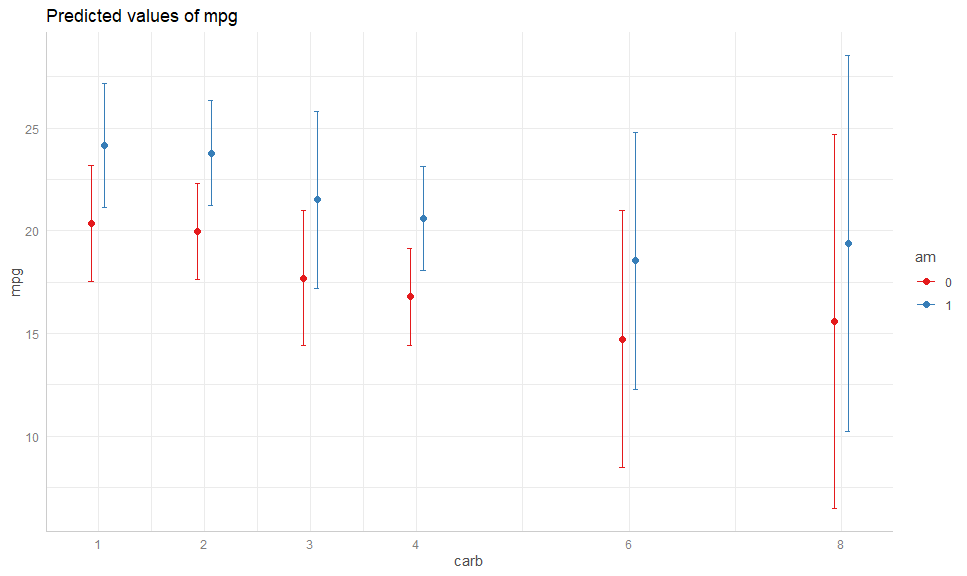<!-- -->

``` r
# To:
autoplot(gge) +
  geom_CI_bar() +
  geom_expected_point()
```

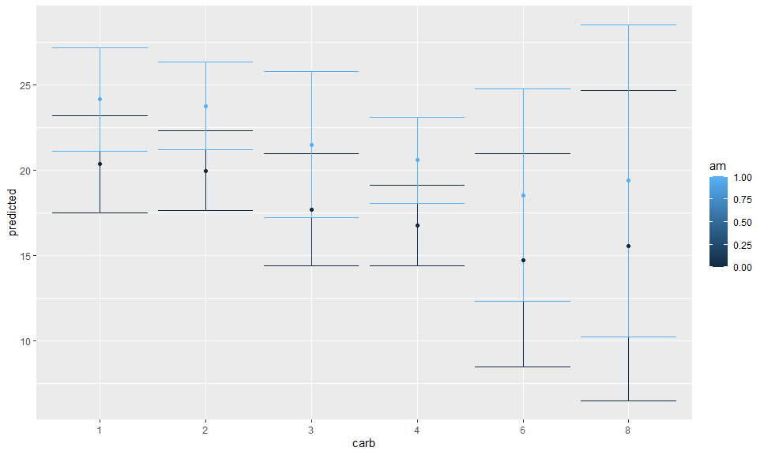<!-- -->

The default plot is better looking than the ugly `ggplot2` default,
however `ggggeffects` is fully customisable, as would be expected (also
note that the `am` is retained as a numeric variable):

``` r
autoplot(
  gge, 
  aes(color = factor(am), fill = after_scale(color)),
  cols = vars(am), 
  labeller = labeller(am = as_labeller(c("0" = "Automatic", "1" = "Manual")))
) +
  geom_CI_bar(width = .3, color = "black", position = position_dodge(0.3)) +
  geom_expected_point(size = 3, position = position_dodge(0.3)) +
  scale_color_brewer(NULL, labels = c("Automatic", "Manual"), type = "qual") +
  theme_bw() +
  labs(x = "No. Cylinders", y = "Miles/Gallon")
```

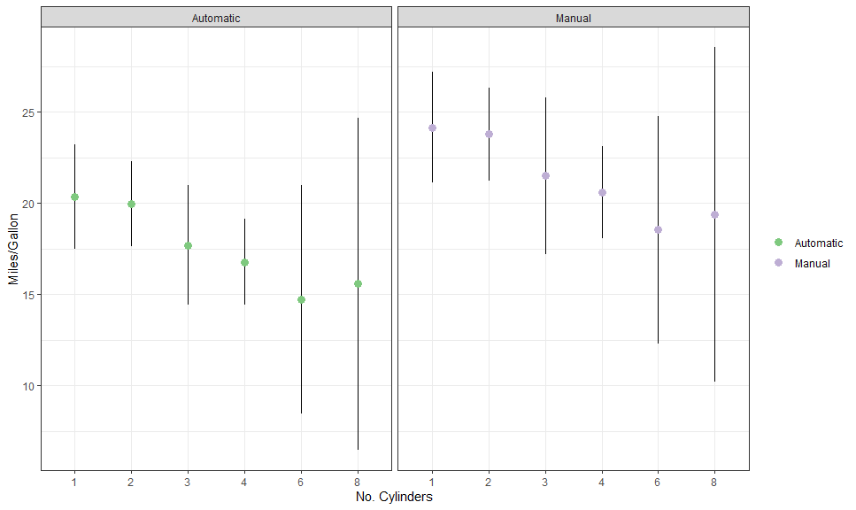<!-- -->

Here is another example, with a continuous variable on x:

``` r
gge <- ggpredict(fit, c("disp", "hp", "am"))

(p <- autoplot(gge, labeller = labeller(am = as_labeller(c("0" = "Automatic", "1" = "Manual")))) +
    geom_CI_ribbon(color = NA, alpha = 0.2) +
    geom_expected_line() +
    scale_color_distiller("Horsepower", 
                          type = "seq", palette = 8, direction = 1,
                          aesthetics = c("color", "fill")) +
    theme_bw() +
    labs(y = "Miles/Gallon", x = "Displacement"))
```

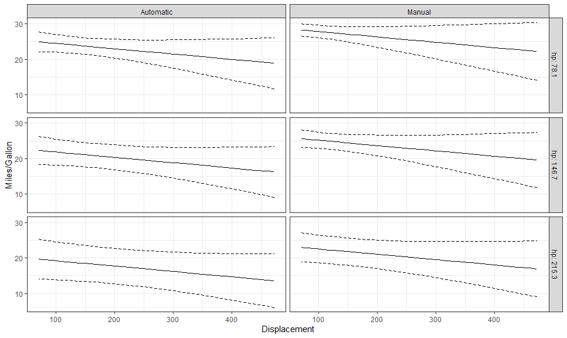<!-- -->

### Adding Raw/Residualized Data

We can use `stat_raw_data` to add the raw data to the plot! It’s so
simple!

``` r
p + stat_raw_data(shape = 21, color = "black")
```

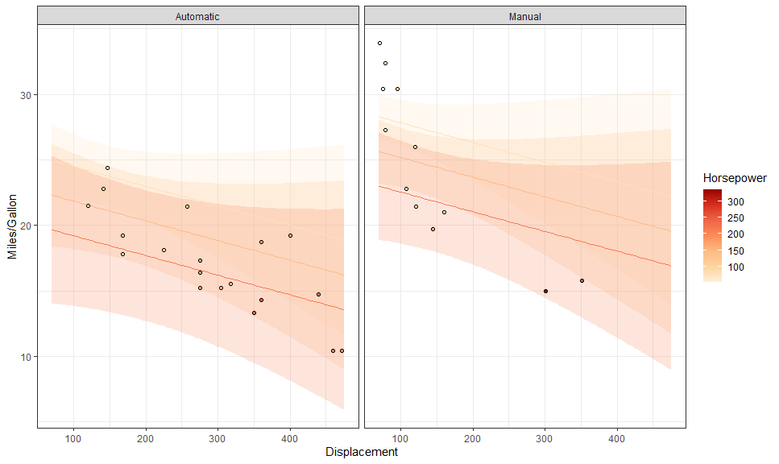<!-- -->

We can also create partial residual plots with
`stat_residualized_data()`:

``` r
p + stat_residualized_data(shape = 21, color = "black")
```

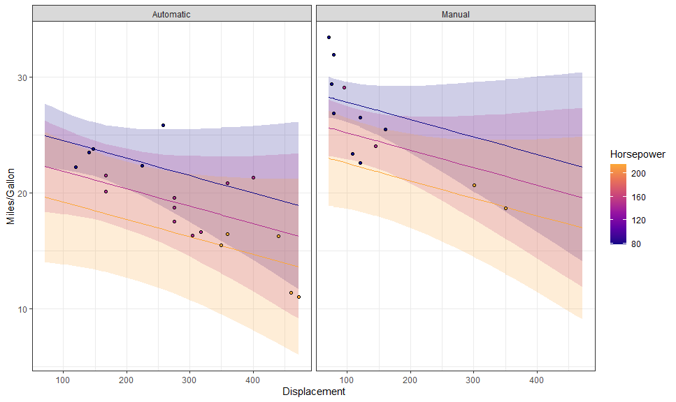<!-- -->

We can even plot them side by side:

``` r
p +
  stat_raw_data(aes(shape = "Raw"), 
                size = 2, alpha = 0.6) +
  stat_residualized_data(aes(shape = "Residualized"), 
                         size = 2,
                         position = position_nudge(x = 10)) +
  scale_shape_manual("Data", values = c(1, 16))
```

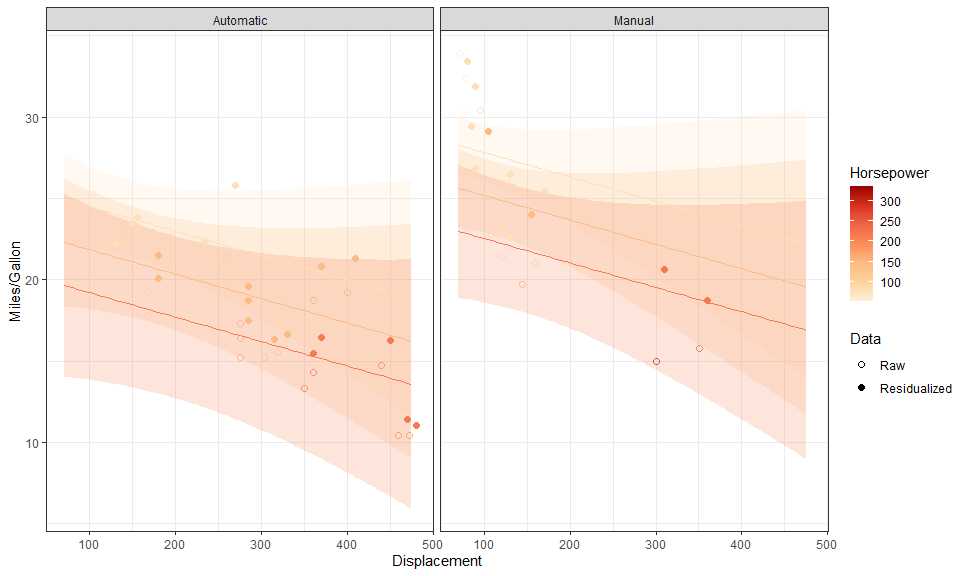<!-- -->

### Raster Plots

We can also plot bi-variate raster plots:

``` r
mod <- lm(Volume ~ poly(Girth, 3) * Height, data = trees)

gge <- ggpredict(mod, c("Girth [n=25]", "Height [n=25]"))

autoplot(gge, aes(x = Girth, y = Height,
                  group = NULL, # need to override
                  color = predicted, fill = predicted)) +
  geom_raster() +
  geom_contour(aes(z = predicted),
               color = "white", linetype = "dashed") +
  stat_raw_data(shape = 21, color = "white", size = 2) +
  scale_color_viridis_c(aesthetics = c("color", "fill")) +
  theme_minimal()
```

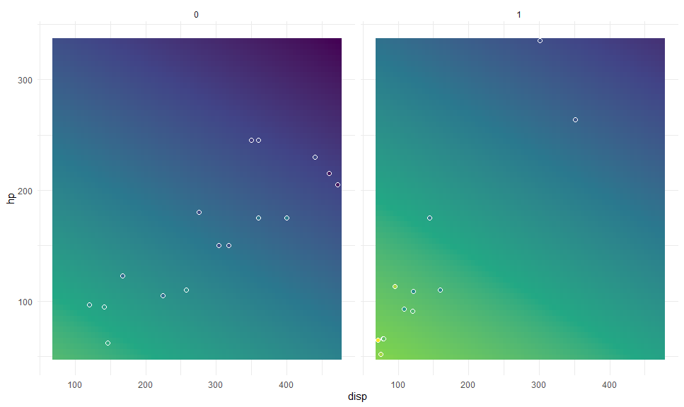<!-- -->

This is especially useful for plotting multi-variate smooth terms in
GAMs:

``` r
library(mgcv)

eg <- gamSim(2, n = 5000, scale = .5)
```

    ## Bivariate smoothing example

``` r
b5 <- gam(y ~ s(x, z, k = 20), data = eg$data)

plot(b5)
```

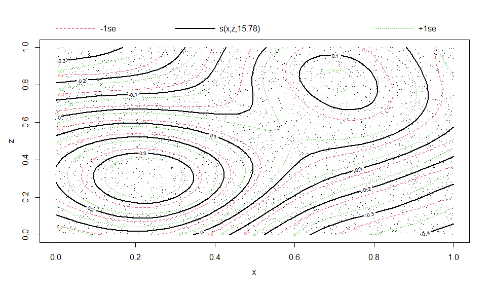<!-- -->

``` r
# Compare to

gge <- ggpredict(b5, c("x [n=45]", "z [n=45]"))

autoplot(gge, aes(x = x, y = z, 
                  group = NULL, # need to override
                  color = predicted, fill = predicted)) +
  geom_raster() +
  geom_contour(aes(z = predicted),
               color = "white", linetype = "dashed") +
  scale_color_viridis_c(aesthetics = c("color", "fill")) +
  theme_minimal()
```

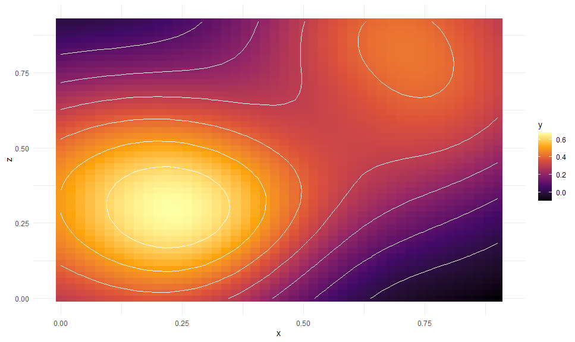<!-- -->

### Collapsing Across Random Variables

Here is an example from MLM Stroop data:

``` r
library(dplyr)

data("stroop", package = "afex")

set.seed(42)

some_stroop_data <- stroop %>%
  filter(study == 1 & acc == 1, trialnum < 60) %>%
  sample_n(1000) %>%
  mutate(
    pno = factor(pno),
    level1_cov = rnorm(n())
  ) %>%
  group_by(pno) %>%
  mutate(level2_cov = rnorm(1)) %>%
  ungroup()

m <- lme4::lmer(rt ~ condition + congruency + level1_cov + level2_cov +
                  (congruency | pno) + ( 1 | trialnum),
                data = some_stroop_data)


gge <- ggemmeans(m, c("congruency", "condition"))
```

    ## Loading required namespace: emmeans

``` r
p <- autoplot(gge) +
  geom_CI_bar(width = .3, color = "black", position = position_dodge(0.7)) +
  geom_expected_line(position = position_dodge(0.7)) +
  geom_expected_point(shape = 21, color = "black", 
                      position = position_dodge(0.7), size = 3) +
  theme_classic()
```

To collapse across a grouping variable, we set `collapse.group` to
`TRUE`:

``` r
p +
  stat_raw_data(collapse.group = TRUE, 
                position = position_jitterdodge(0.1,,0.7), alpha = 0.3)
```

    ## Warning: More than one random grouping variable found.
    ## Using `pno`.

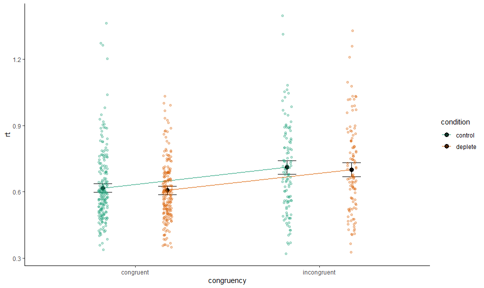<!-- -->

Or specify by name:

``` r
p +
  stat_raw_data(collapse.group = "trialnum", 
                position = position_jitterdodge(0.1,,0.7), alpha = 0.3)
```

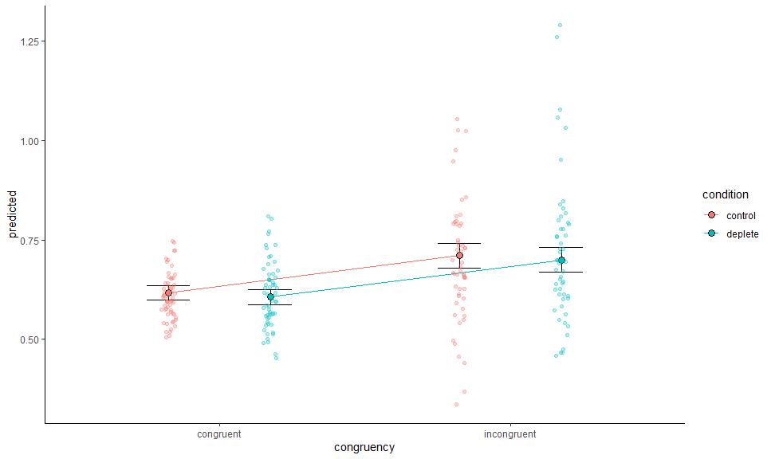<!-- -->

We can combine and mix as we please:

``` r
p +
  stat_raw_data(collapse.group = "pno", 
                aes(shape = "pno", x = as.numeric(congruency) + .05),
                position = position_jitterdodge(0.1,,0.7), alpha = 0.3) +
  stat_raw_data(collapse.group = "trialnum", 
                aes(shape = "trialnum", x = as.numeric(congruency) - .05),
                position = position_jitterdodge(0.1,,0.7), alpha = 0.3) +
  scale_shape_manual("Random var", values = c(16, 8))
```

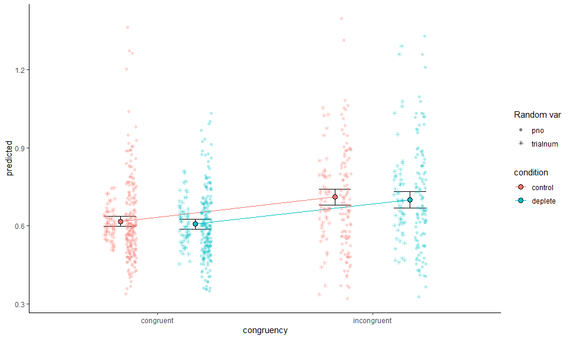<!-- -->

We can do the same for residualized data, or with a continuous variable
on x (though this only really works nicely if the covariate is on level
2+) - or both:

``` r
gge <- ggemmeans(m, c("level2_cov [all]", "congruency", "condition"))

autoplot(gge) +
  geom_CI_ribbon(color = NA, alpha = 0.1) +
  geom_expected_line() +
  stat_residualized_data(collapse.group = "pno", alpha = 0.4) +
  theme_classic()
```

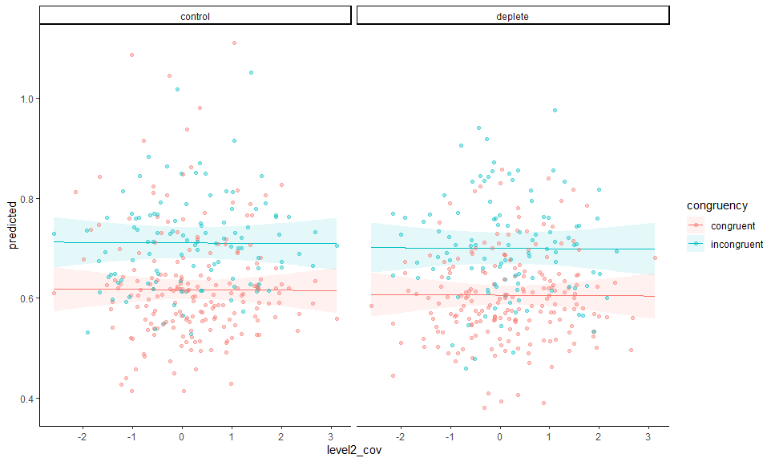<!-- -->
